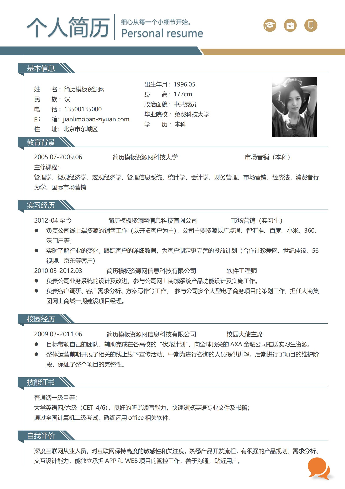
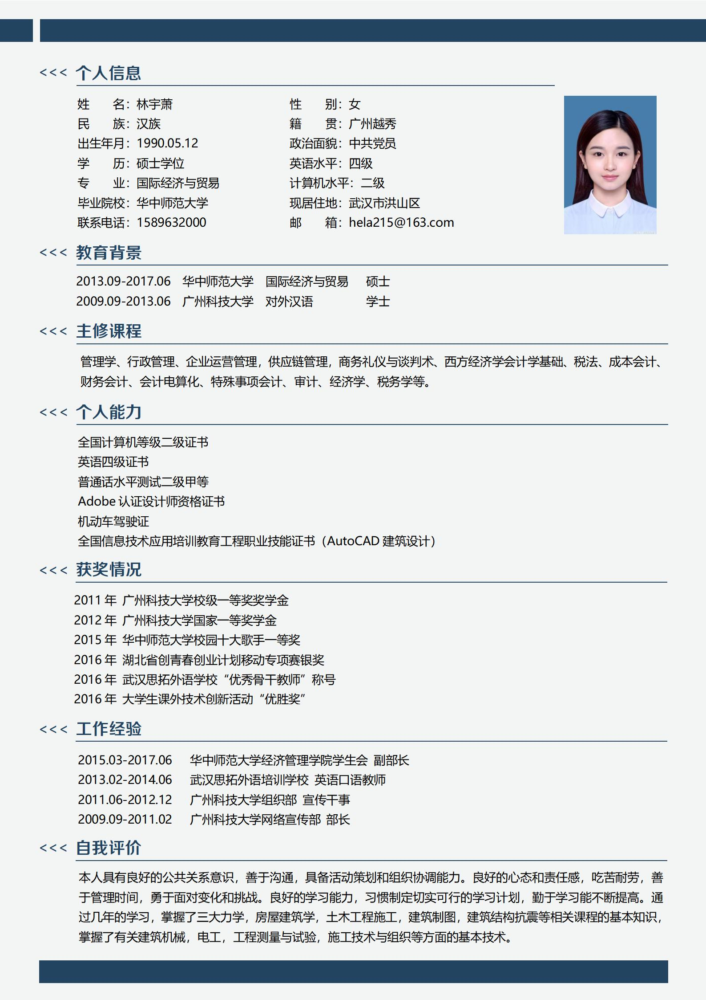

<h1>简历收集</h1>

收集全网的中英文简历，总有一款适合你。

Resume collection from all over the Internet, there will be one that suits you.

中文简历|[EnglishResume]()|[多页简历]()|[简历封面]()|[信息表格]()

---

涵盖多种风格，各行各业的简历模板，收集自网络，免费分享。
 

若出现兼容性问题，请自行修改后缀名.docx<=>.doc

 
 
 
 
 

| 简历预览 | 下载 | 简历预览 | 下载 |
|---------|------|---------|------| 
|`非常好用的免费简历模板`|[001](1.中文简历/001/)|`简约风求职简历模板`|[002](1.中文简历/002/)| 
|`应届毕业生免费简历模板`|[003](./1.中文简历/003/)|`砖红色通用免费简历模板`|[004](1.中文简历/004/)|  

| Header 1 | Header 2 | Header 3 |
|----------|----------|----------|
| Cell 1   | Cell 2   | Cell 3   |
| Cell 4   | Cell 5   | Cell 6   |